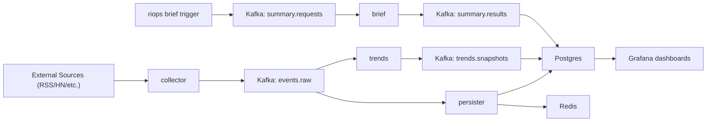

# Rising Intelligence

Rising Intelligence is a self-hosted, near-real-time pipeline for turning high-volume tech signals into ranked trends and evidence-grounded briefs.

If you are new to this repo, this README is the fastest path to:

1. understand the system shape,
2. run it locally, and
3. verify end-to-end behavior.

## What this system does

At a high level:

1. **Collector** ingests source items and publishes normalized events to Kafka (`events.raw`).
2. **Persister** materializes events into Postgres + Redis.
3. **Trends** computes ranked trend snapshots from event windows.
4. **Brief** consumes explicit summary requests and generates human-readable briefs.

The system is **request-driven for brief generation**: no automatic brief publish path from Trends.

## Architecture at a glance



## Quickstart (local)

### 1. Prerequisites

- Docker + Docker Compose
- Node.js 20+
- npm 10+

### 2. Install dependencies

```bash
npm install
npm run build
```

### 3. Configure environment

```bash
cp .env.example .env
```

At minimum, set `POSTGRES_PASSWORD` in `.env`.

### 4. Start the full stack

```bash
docker compose up --build
```

Use detached mode if preferred:

```bash
docker compose up -d --build
```

Stop:

```bash
docker compose down
```

Reset state (volumes):

```bash
docker compose down -v
```

Optional profiles:

```bash
docker compose --profile console up -d
docker compose --profile promtail up -d
```

- `console` enables Redpanda Console on `http://localhost:8080`.
- `promtail` is mainly for Linux host log scraping; macOS users typically rely on OTLP logs.

## Verify it is working

### Core UIs and endpoints

- Grafana: http://localhost:3001 (`admin` / `admin`)
- Schema Registry: http://localhost:8081
- Collector health: http://localhost:3002/health
- Persister health: http://localhost:3003/health
- Trends health: http://localhost:3004/health
- Brief health: http://localhost:3005/health

### Quick health checks

```bash
curl -fsS http://localhost:3002/health | jq .
curl -fsS http://localhost:3003/health | jq .
curl -fsS http://localhost:3004/health | jq .
curl -fsS http://localhost:3005/health | jq .
```

### Trigger a brief manually

```bash
./node_modules/.bin/riops brief trigger --dry-run
./node_modules/.bin/riops brief trigger
```

If you need diagnostics around the request/response path:

```bash
./node_modules/.bin/riops brief diagnose --timeout 180
```

## Common developer commands

### Repository-level

```bash
npm run build
npm run lint
npm run test
```

### Workspace-specific loops

```bash
npm run dev --workspace=@rising-intelligence/collector
npm run dev --workspace=@rising-intelligence/persister
npm run dev --workspace=@rising-intelligence/trends
npm run dev --workspace=@rising-intelligence/brief
```

### Database workflows

```bash
npm run db:migrate
npm run db:seed
npm run retention:cleanup
```

### End-to-end brief test (Compose-backed)

```bash
npm run test:e2e:brief:compose
```

## Ops CLI (`riops`)

This repo standardizes operational actions through `riops` (`packages/ops-cli`).

Useful commands:

```bash
./node_modules/.bin/riops kafka topics
./node_modules/.bin/riops kafka ensure-topics
./node_modules/.bin/riops schema-registry publish-protos
./node_modules/.bin/riops topics list --counts
./node_modules/.bin/riops events enrich --dry-run
./node_modules/.bin/riops db snapshot
```

## Repository map

```text
apps/           Deployable services (collector, persister, trends, brief)
packages/       Shared libraries (contracts, platform utilities, ops-cli, db)
infra/          Local stack configs (Grafana, OTel, Loki, Tempo, Mimir, etc.)
specs/          System-level specs (source of truth)
tests/          End-to-end and integration test assets
```

## Spec-first workflow

This repository is spec-first:

- cross-cutting behavior is defined in `specs/`,
- each service has a local spec bundle in `apps/<service>/spec/`,
- code and specs should evolve together.

If you are implementing behavior changes, start from the relevant spec before coding.

## Read in this order

1. [`specs/000-quickstart.md`](specs/000-quickstart.md)
2. [`specs/001-real-time-personal-intelligence-system.md`](specs/001-real-time-personal-intelligence-system.md)
3. [`specs/007-operations-runbook.md`](specs/007-operations-runbook.md)
4. Service spec for your area:
   - [`apps/collector/spec/spec.md`](apps/collector/spec/spec.md)
   - [`apps/persister/spec/spec.md`](apps/persister/spec/spec.md)
   - [`apps/trends/spec/spec.md`](apps/trends/spec/spec.md)
   - [`apps/brief/spec/spec.md`](apps/brief/spec/spec.md)
