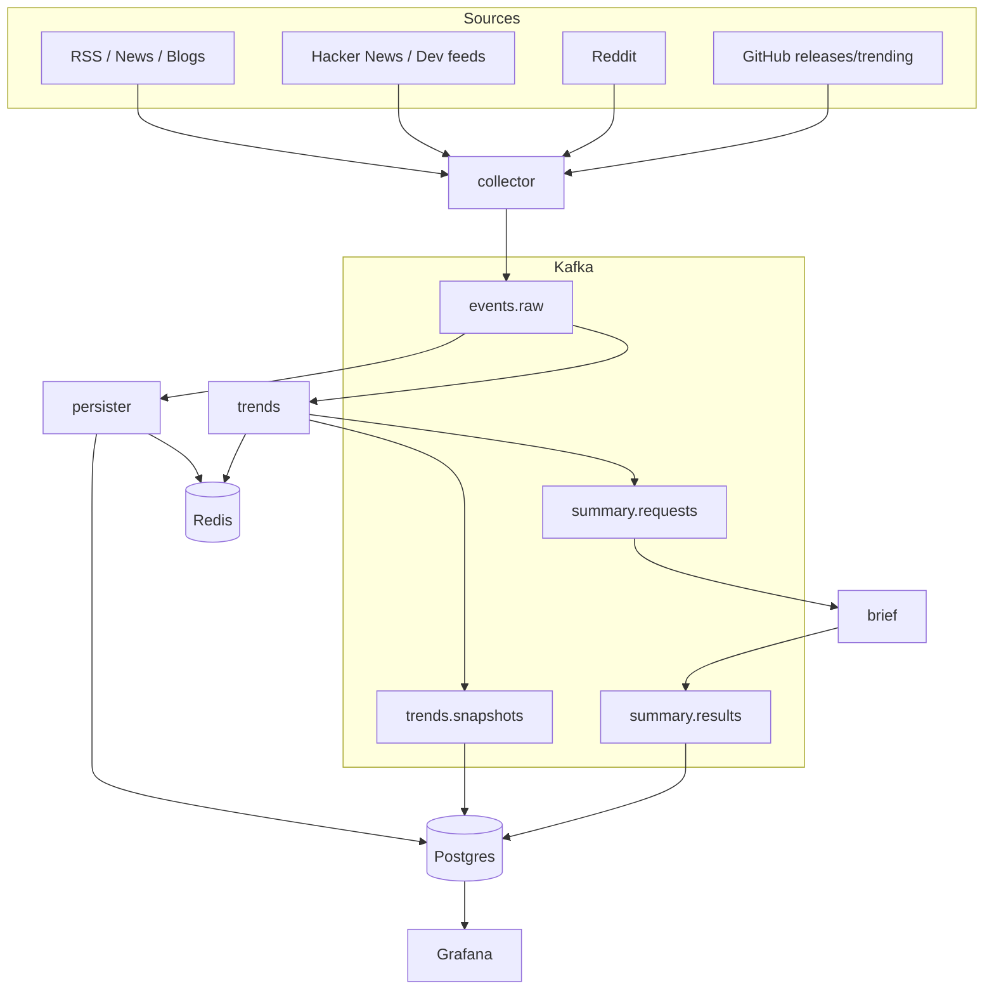

# Spec 001: Real-Time Personal Intelligence System

**Created**: 2026-02-05
**Updated**: 2026-02-05
**Status**: Proposed

## Overview

Build a self-hosted, near-real-time “personal intelligence aggregator” that:

1) continuously ingests signals from curated tech sources and social/developer platforms,  
2) detects which topics are gaining traction (volume + acceleration), and  
3) produces actionable briefs and dashboards (with optional alerts).

The system is optimized for a single operator (you) monitoring tech, AI, and AWS trends on a home network.

## Goals

- Ingest multiple sources (social + curated) into a uniform event stream.
- Detect emerging trends using volume and acceleration metrics on sliding windows.
- Generate daily (and optionally on-demand) topic briefs with links and suggested actions.
- Provide real-time dashboards for both raw chatter and computed trend metrics.
- Keep components decoupled so ingestion, trend detection, and LLM summarization can evolve independently.

## Non-goals

- Building a generalized “web crawler” or full-text search engine.
- Multi-tenant SaaS, complex user management, or external public-facing APIs.
- Perfect topic modeling from day 1 (MVP relies on allowlisted topics + simple entity extraction).
- Long-term archival of all raw content (retain enough for trend windows + short replay).
- “Real-time” LLM processing per-event (LLM runs on aggregates to control cost/latency).

## Definitions

- **Event**: A normalized record of a single source item (tweet/post/article/release).
- **Topic**: A tracked term/entity/category used for counting (e.g., “AWS”, “Bedrock”, “Rust”, “OpenAI”).
- **Volume**: Count of events mentioning a topic within a window (e.g., 60 minutes).
- **Acceleration**: Change in volume/rate between windows (e.g., last 60m vs previous 60m), optionally normalized to a baseline.
- **Trend Score**: A composite score used to rank topics (volume + acceleration + baseline delta).
- **Brief**: An LLM-generated report summarizing top trends with source links and suggested actions.

## Repository Layout (Specify-Poker Style)

This repo follows the same documentation + monorepo shape as `specify-poker`:

- System intent and cross-cutting constraints live in `specs/`.
- Each deployable service lives in `apps/<service>/` with a local spec bundle in `apps/<service>/spec/`.
- Shared runtime primitives and contracts live in `packages/shared/` (schemas, config, lifecycle, telemetry helpers).
- Local-first infrastructure wiring lives in `infra/` and `docker-compose.yml`.

Planned tree:

```text
apps/
  collector/          # multi-source ingestion → Kafka (events.raw)
    spec/
  persister/          # Kafka consumer → Postgres + Redis (materialized views)
    spec/
  trends/             # Kafka consumer → windowed aggregation + scoring
    spec/
  brief/              # Kafka consumer → LLM summarization
    spec/
packages/
  shared/             # contracts + config + lifecycle + telemetry + kafka helpers
  db/                 # Prisma schema + client
infra/
  grafana/            # provisioning + dashboards
  postgres/           # bootstrap only (schema managed by Prisma)
  loki/
  mimir/
  tempo/
  otel/
  config/             # topics allowlist
specs/                # thematic system specifications
```

## Requirements

### Functional

- **R-001 (Ingestion)**: The system MUST ingest items from at least 3 sources in MVP:
  - 1 curated source (RSS/news/blogs),
  - 1 developer community source (e.g., Hacker News, GitHub releases),
  - 1 discussion source (e.g., Reddit).
- **R-002 (Normalization)**: All ingested items MUST be converted to a shared `RawEvent` schema and published to the stream.
- **R-003 (Idempotency)**: Ingestion MUST emit a stable `event_id` per source item and perform best-effort deduplication within a Collector instance; downstream consumers MUST remain idempotent under at-least-once delivery.
- **R-004 (Trend Metrics)**: The system MUST compute topic metrics on sliding windows and publish periodic `TrendSnapshot` outputs.
- **R-005 (Ranking)**: The system MUST output a ranked “Top N Trends” list for a configurable window (e.g., 60m and 24h).
- **R-006 (Brief Generation)**: The system MUST produce a daily brief (scheduled) from top trends and their supporting items.
- **R-007 (Dashboards)**: The system MUST expose dashboards for:
  - raw event exploration (search/filter by source/topic),
  - trend time series and “Top N” tables,
  - latest brief content.
- **R-008 (Alerts, Optional MVP)**: The system SHOULD support alerting when a trend crosses a threshold (score or acceleration).
- **R-009 (Contracts)**: The system MUST publish Kafka topic schemas (and gRPC `.proto` contracts) to the Schema Registry for compatibility-safe evolution.

### Non-functional

- **NFR-001 (Latency)**: Ingested events SHOULD be available for processing within 60 minutes of occurrence. This is a **relaxed target** - trend detection does not require real-time data. Polling intervals of 5-15 minutes per source are acceptable.
- **NFR-002 (Replay)**: The pipeline MUST support replay/reprocessing for at least 7 days of data.
- **NFR-003 (Resilience)**: The system MUST tolerate upstream source outages and API rate limiting without data corruption. On restart after downtime, the Collector resumes normal polling without aggressive catch-up.
- **NFR-004 (Cost Control)**: LLM usage MUST be bounded (batch + top-trends only) with a configurable daily token/cost budget.
- **NFR-005 (Local-first Security)**: Secrets MUST be stored out of source control and not logged.
- **NFR-006 (Auditability)**: Trend scores and briefs MUST link back to source URLs/IDs used as evidence.
- **NFR-007 (Data Freshness)**: Briefs MUST NOT be generated when consumer lag exceeds configured thresholds.
- **NFR-008 (Throttled Ingestion)**: Ingestion MUST be throttled with bounded batch sizes per poll cycle. No source should be polled more frequently than every 5 minutes. Missing some posts during high-volume periods is acceptable.

## Invariants (“Constitution”)

- **I-001**: Raw source content is immutable once ingested (append-only); downstream processing is derived data.
- **I-002**: Consumers MUST be safe under at-least-once delivery (duplicates are expected).
- **I-003**: Briefs MUST include citations (links) for each major claim or trend driver.
- **I-004**: No secrets (API keys/tokens) are ever emitted to logs, Kafka topics, or dashboard panels.

## Architecture

### Design Principle: Kafka as the Central Driver

**Kafka topics are the main driver of activity in this system.** Services communicate via Kafka, and derived state (Postgres, Redis) is materialized by consumers. This provides:

- **Single source of truth**: Kafka is the append-only event log
- **Decoupled services**: Each service has a single responsibility
- **Replay-friendly**: All derived state can be rebuilt from Kafka
- **At-least-once semantics**: Duplicates are expected; consumers are idempotent

### High-level components

- **Collector service** (`apps/collector`): fetch (multiple sources) → normalize → publish to Kafka. Does NOT write to Postgres/Redis directly.
- **Kafka (Redpanda)**: central event bus + retention for replay. The source of truth for all events.
- **Persister service** (`apps/persister`): consumes `events.raw` → writes to Postgres + Redis. Lightweight materializer.
- **Trends service** (`apps/trends`): consumes `events.raw` → topic extraction + windowed aggregation + scoring → publishes snapshots.
- **Brief service** (`apps/brief`): consumes `summary.requests` → LLM summarization → publishes results.
- **Storage**:
  - **Postgres**: queryable materialized views (raw events, snapshots, briefs). See `specs/005`.
  - **Redis**: ephemeral state (window aggregation, seen cache). See `specs/006`.
- **Observability** (LGTM stack):
  - **Loki** for application logs (service debug logs, NOT raw events).
  - **Mimir** for Prometheus-compatible metrics.
  - **Tempo** for distributed traces.
- **Grafana dashboards**: metrics, logs, top trends, and brief display.

### Data flow



### Kafka Topics

| Topic | Producer | Consumer(s) | Partition Key | Purpose |
|-------|----------|-------------|---------------|---------|
| `events.raw` | Collector | Persister, Trends | `source` | Normalized source events |
| `events.raw.dlq` | Collector | (manual inspection) | `source` | Failed parse/normalize |
| `collector.heartbeat` | Collector | Trends | `source` | Per-source health heartbeats |
| `trends.snapshots` | Trends | (stored to Postgres) | `window` | Periodic trend rankings |
| `summary.requests` | Trends | Brief | `request_id` | Request to generate a brief |
| `summary.results` | Brief | (stored to Postgres) | `request_id` | Generated briefs |

**Partition key rationale**: Using `source` for events provides even distribution across partitions and allows source-specific consumer scaling. Each source (RSS, Reddit, HN, etc.) gets its own partition, enabling parallelism without hot-spot issues that time-based keys would cause during traffic spikes.

### Service Responsibilities

| Service | Reads From | Writes To | Responsibility |
|---------|------------|-----------|----------------|
| Collector | External APIs | Kafka (`events.raw`) | Ingest + normalize |
| Persister | Kafka (`events.raw`) | Postgres, Redis | Materialize queryable state |
| Trends | Kafka (`events.raw`), Postgres (evidence), Redis | Kafka, Postgres, Redis | Compute trends, trigger briefs |
| Brief | Kafka (`summary.requests`) | Kafka, Postgres | LLM summarization |

**Key insight**: Collector has no database dependencies. It only talks to external APIs and Kafka. This keeps ingestion fast and simple.

**Note on Trends → Postgres**: When building a `SummaryRequest`, the Trends service queries `raw_events` to retrieve evidence items (title, text_excerpt, URL) for top topics. This is a read-only dependency; Trends does not modify `raw_events`.

## Event & Topic Model

### RawEvent schema (contract)

MVP uses a single canonical schema for all sources.

Canonical wire contract: `packages/shared/contracts/proto/rising_intelligence/v1/contracts.proto` (`RawEvent`).

```ts
export type Source =
  | "rss"
  | "news"
  | "hackernews"
  | "reddit"
  | "github"
  | "bluesky"
  | "mastodon";
  // NOTE: "twitter" is deprecated - API requires Enterprise tier ($42K+/year)

export interface RawEvent {
  event_id: string; // stable per-source unique ID (e.g., tweet id, reddit fullname, URL hash)
  source: Source;
  fetched_at: string; // ISO8601
  published_at?: string; // ISO8601 (if known)

  url?: string;
  title?: string;
  text: string; // primary content for extraction/search

  author?: { id?: string; handle?: string; display_name?: string };
  engagement?: { score?: number; comments?: number; likes?: number; shares?: number };

  // Derived at ingestion time (cheap)
  lang?: string;
  tags?: string[]; // MVP: canonical topic keys (e.g., ["aws.bedrock", "ai.llm"]); may include free-form tags in future
  extracted?: {
    hashtags?: string[];
    urls?: string[];
  };

  // Free-form metadata per-source (kept small; no secrets)
  source_meta?: Record<string, unknown>;
}
```

### TrendSnapshot schema (contract)

Canonical wire contract: `packages/shared/contracts/proto/rising_intelligence/v1/contracts.proto` (`TrendSnapshot`).

```ts
export interface TopicMetrics {
  topic: string; // canonical topic key, e.g. "aws.bedrock"
  window: "15m" | "60m" | "24h";
  window_end: string; // ISO8601

  volume: number; // count in window
  prev_volume?: number; // previous equal-sized window
  acceleration?: number; // e.g., (volume - prev_volume) / max(prev_volume, 1)
  baseline_volume?: number; // e.g., 30d day-of-week/hour median for that window slot
  baseline_delta?: number; // e.g., (volume - baseline) / max(baseline, 1)

  score: number; // normalized 0..10 (or 0..100), configurable
  evidence?: { top_urls: string[]; top_event_ids: string[] };
}

export interface TrendSnapshot {
  generated_at: string; // ISO8601
  window: "15m" | "60m" | "24h";
  topics: TopicMetrics[]; // sorted desc by score
}
```

### Topic extraction (MVP)

MVP topic extraction uses:

- an **allowlist** of canonical topics with matchers (regex, keyword sets), and
- lightweight entity hints (hashtags, repo names, product names) extracted from `RawEvent.text/title`.

The allowlist MUST support aliases (e.g., "EC2" → `aws.ec2`, "Bedrock" → `aws.bedrock`).

### Cross-Source Story Deduplication

**Problem**: The same story (e.g., an AWS announcement) appears across multiple sources:
- Original blog post (RSS)
- Reddit posts linking to it (multiple subreddits)
- Hacker News discussion
- Social posts referencing it (Bluesky/Mastodon)

Without deduplication, volume metrics over-count because we're measuring "mentions" not "unique stories."

**Solution**: URL-based story clustering in the Trends service, applied per topic per window.

#### Where Dedup Lives

| Service | Dedup Responsibility |
|---------|---------------------|
| Collector | None - publishes all events |
| Persister | None - writes all events to Postgres (preserves evidence diversity) |
| Trends | **URL-based story dedup** when counting for windows |

This design keeps Collector and Persister simple while ensuring trend counts are accurate.

#### URL-based Story Clustering

Events that share a canonical URL are grouped as the same "story" within a topic window:

```typescript
interface StoryCluster {
  story_id: string;           // hash of canonical URL
  canonical_url: string;      // normalized URL (no query params, lowercase)
  first_seen_at: string;      // earliest fetched_at in window
  source_events: string[];    // event_ids that reference this URL
  sources: Source[];          // unique sources that covered it
}
```

**URL normalization**:
- Remove query parameters (except significant ones like `?id=`)
- Remove tracking parameters (`utm_*`, `ref`, `source`)
- Lowercase hostname
- Remove trailing slashes
- Handle URL shorteners by following redirects (cache resolved URLs)

**Linking events to stories**:
- Events with URLs: extract and normalize URL → lookup/create story
- Events without URLs (social posts): attempt to link via extracted URLs in `text`
- Events with no extractable URL: treated as standalone (counted as individual event)

#### Counting Strategy

For trend scoring, count **unique stories** not raw events:

```typescript
function calculateTopicVolume(
  events: RawEvent[],
  window: TrendWindow
): number {
  // Group events by canonical URL
  const stories = new Map<string, StoryCluster>();

  for (const event of events) {
    const canonicalUrl = normalizeUrl(event.url ?? extractFirstUrl(event.text));

    if (canonicalUrl) {
      // URL-based grouping
      const existing = stories.get(canonicalUrl);
      if (existing) {
        existing.source_events.push(event.event_id);
        existing.sources.push(event.source);
      } else {
        stories.set(canonicalUrl, {
          story_id: hash(canonicalUrl),
          canonical_url: canonicalUrl,
          first_seen_at: event.fetched_at,
          source_events: [event.event_id],
          sources: [event.source],
        });
      }
    } else {
      // No URL - count as standalone story
      stories.set(event.event_id, {
        story_id: event.event_id,
        canonical_url: '',
        first_seen_at: event.fetched_at,
        source_events: [event.event_id],
        sources: [event.source],
      });
    }
  }

  return stories.size; // Unique stories, not events
}
```

#### Redis Key Structure for Story Tracking

```
story:{window}:{topic}:{bucket}:{canonical_url_hash} → StoryCluster JSON
story_count:{window}:{topic}:{bucket} → integer (unique story count)
```

TTL: 3× window size (same as event dedup)

#### Source Diversity Bonus (Optional)

Stories covered by multiple sources may be weighted higher:

```typescript
function calculateDiversityBonus(story: StoryCluster): number {
  const uniqueSources = new Set(story.sources).size;
  // Bonus: 1.0 for 1 source, 1.2 for 2, 1.4 for 3+
  return 1 + Math.min(uniqueSources - 1, 2) * 0.2;
}
```

#### Configuration

```yaml
# In topics.allowlist.yaml or separate config
story_dedup:
  enabled: true
  url_normalization:
    remove_query_params: true
    preserve_query_params: ["id", "v"]  # YouTube video ID, etc.
    remove_tracking_params: ["utm_*", "ref", "source", "fbclid"]
    follow_redirects: true
    redirect_cache_ttl_seconds: 86400
  diversity_bonus:
    enabled: false  # Optional: boost multi-source stories
    max_bonus: 1.4
```

### Topic Discovery (Emerging Terms)

**Problem**: The allowlist only tracks known topics. When AWS announces "Project Cypress" (a new product), the system won't recognize it until manually added.

**Solution**: Track unknown high-frequency terms and surface them for review.

#### How It Works

1. **Extract candidate terms** from each event:
   - Hashtags (e.g., `#ProjectCypress`)
   - Capitalized phrases (2-3 words, e.g., "Project Cypress")
   - @mentions on social platforms
   - Quoted terms in titles

2. **Filter out known topics**: Remove terms that match existing allowlist matchers

3. **Count unknown terms** in sliding windows (same as topic volumes)

4. **Flag emerging unknowns**: Terms that exceed `DISCOVERY_VOLUME_THRESHOLD` (default: 10 mentions/hour) AND have acceleration > 2x

5. **Surface for review**: Write to `discovery.candidates` table or emit metric

#### Implementation

```typescript
interface DiscoveryCandidate {
  term: string;              // The unknown term (normalized)
  first_seen_at: string;     // When first observed
  volume_60m: number;        // Current hour volume
  acceleration: number;      // vs previous hour
  sample_event_ids: string[]; // 3-5 example events
  sources: Source[];         // Where it appeared
}
```

**Redis keys** (similar to topic windows):
- `discovery:term:{normalized_term}:{bucket}` - volume counter
- `discovery:samples:{normalized_term}` - sample event IDs (capped list)

**Extraction heuristics**:
```typescript
const TERM_PATTERNS = [
  // Hashtags
  /#([A-Za-z][A-Za-z0-9_]{2,30})/g,
  // Capitalized phrases (2-3 words)
  /\b([A-Z][a-z]+(?:\s+[A-Z][a-z]+){1,2})\b/g,
  // Product names with version (e.g., "GPT-5", "Claude 4")
  /\b([A-Z][a-z]*[-\s]?\d+(?:\.\d+)?)\b/g,
];

function extractCandidateTerms(text: string): string[] {
  const candidates = new Set<string>();
  for (const pattern of TERM_PATTERNS) {
    for (const match of text.matchAll(pattern)) {
      candidates.add(normalizeTermForDiscovery(match[1]));
    }
  }
  return [...candidates];
}
```

**Normalization**:
- Lowercase
- Remove leading `#` or `@`
- Collapse whitespace
- Skip common words ("The New", "This Week", etc.)

#### Output

**Option A: Postgres table** (queryable in Grafana):
```sql
CREATE TABLE discovery_candidates (
  term TEXT PRIMARY KEY,
  first_seen_at TIMESTAMPTZ,
  last_seen_at TIMESTAMPTZ,
  volume_24h INT,
  peak_acceleration FLOAT,
  sample_urls TEXT[],
  status TEXT DEFAULT 'pending', -- pending, added, ignored
  added_to_allowlist_at TIMESTAMPTZ
);
```

**Option B: Grafana alert** when unknown term spikes:
- Alert rule: `discovery_candidate_volume > 10 AND discovery_candidate_acceleration > 2`
- Notification includes term, volume, and sample URLs

#### Workflow

1. System detects "Project Cypress" spiking (unknown term)
2. Alert fires or dashboard shows candidate
3. Operator reviews sample events
4. Operator adds to allowlist (or ignores)
5. Historical events are NOT reprocessed (term tracked going forward)

#### Configuration

```yaml
discovery:
  enabled: true
  volume_threshold: 10        # Min mentions/hour to surface
  acceleration_threshold: 2.0 # Min acceleration multiplier
  max_candidates: 100         # Cap tracked unknowns (LRU eviction)
  ignore_patterns:            # Skip these even if frequent
    - "^(the|this|that|new|big)\\s"
    - "^\\d+$"                # Pure numbers
```

### Topic Backfill Strategy

**Problem**: When a new topic is added to the allowlist (e.g., AWS launches "Project Cypress"), historical events in Postgres won't have that topic tagged because topic extraction happens at ingestion time.

**Design Decision**: Accept cold start for new topics. Do NOT backfill.

**Rationale**:
- Trend detection is forward-looking; historical accuracy is less important
- Backfill adds complexity (re-processing, dedup handling, window recalculation)
- Most new topics are "hot" precisely because they're new (little historical data anyway)
- If you add a topic for an existing concept (e.g., adding `ai.claude` when it already existed), the first few days of data will be sparse, then it stabilizes

**Behavior when adding a new topic**:
1. Add topic to `topics.allowlist.yaml`
2. Restart Collector (picks up new allowlist)
3. New events are tagged with the new topic
4. Historical events in Postgres remain unchanged
5. Trend baseline starts accumulating from day 1 of the new topic
6. After 30+ days, baselines become robust (with day-of-week/hour coverage)

**What this means for briefs**:
- A newly added topic may spike immediately (no baseline to compare against)
- The Brief service should note when a topic has < 30 days of data: "New topic, limited historical context"

**Optional: Query-Time Topic Matching**

For ad-hoc analysis of historical data, Grafana queries CAN apply topic matchers at query time:

```sql
-- Find historical events that WOULD match a topic (slow, for exploration only)
SELECT *
FROM raw_events
WHERE text ILIKE '%Bedrock%'
  AND fetched_at > NOW() - INTERVAL '30 days';
```

This is NOT used for trend scoring (too slow), only for manual investigation.

**Alternative (Not Implemented)**: A nightly job could re-run topic extraction on recent events and update `raw_events.topics`. This is deferred because:
- Adds complexity (dedup with already-tagged events)
- Window counts would need recalculation
- Marginal benefit for personal use

### Topics allowlist file (v1)

`TOPICS_ALLOWLIST_PATH` points to a committed, non-secret YAML file (example: `infra/config/topics.allowlist.yaml`) with:

- `topics[]` entries:
  - `key` (canonical dotted key, e.g. `aws.bedrock`)
  - `display_name` (human-friendly)
  - `aliases[]` (strings; used for UX and optional match hints)
  - `matchers[]`:
    - `{ type: "keyword", value: "..." }` (token-ish contains match)
    - `{ type: "regex", pattern: "..." }` (RE2-compatible; default case-insensitive if configured)
- `suppression.muted_topics[]`: canonical keys to exclude from ranking/alerts
- `defaults.max_topics_per_event`: upper bound to keep extraction bounded and deterministic

MVP matcher semantics:

- `keyword`: case-insensitive substring match against `title + text`
- `regex`: applied against `title + text`

## Streaming & Storage Contracts

### Kafka topics (suggested)

- `events.raw`: all `RawEvent` messages (partition key: `source`).
- `events.raw.dlq`: failed parse/normalize (`DeadLetterEvent`; partition key: `source`; includes safe context; no secrets).
- `trends.snapshots`: periodic `TrendSnapshot` (partition key: `window`).
- `summary.requests`: requests to generate a brief (`SummaryRequest`; partition key: `request_id`; daily or threshold-triggered).
- `summary.results`: produced brief results (`BriefResult`; partition key: `request_id`; success or failure + metadata).

### Retention

**IMPORTANT**: Kafka retention MUST be >= Postgres retention for the same data, to ensure rebuild capability.

| Topic | Kafka Retention | Postgres Retention | Notes |
|-------|-----------------|-------------------|-------|
| `events.raw` | 14 days | 14 days (`raw_events`) | Aligned for rebuild capability |
| `trends.snapshots` | 90 days | 90 days (`trend_snapshots`) | Small data, keep longer |
| `summary.results` | 180 days | 180 days (`brief_results`) | Very small, high value |

If Kafka retention expires before Postgres cleanup and Postgres data is corrupted, events in that window are lost permanently.

## Configuration

All configuration MUST be externalized (env vars and/or config files) and safe to commit (no secrets).

### Required (MVP)

- `KAFKA_BROKERS` (e.g., `localhost:9092`)
- `KAFKA_CLIENT_ID`
- `KAFKA_CONSUMER_GROUP` (per service)
- `REDIS_URL` (e.g., `redis://localhost:6379`)
- `TOPICS_ALLOWLIST_PATH` (aliases + matchers)
- `SCHEMA_REGISTRY_URL` (e.g., `http://localhost:8081`)
- Postgres:
  - `POSTGRES_HOST` (e.g., `postgres` in Compose)
  - `POSTGRES_PORT` (e.g., `5432`)
  - `POSTGRES_DB`
  - `POSTGRES_USER`
  - `POSTGRES_PASSWORD` (or `POSTGRES_PASSWORD_FILE`)

### Source configuration (suggested)

- RSS/Blogs: `RSS_FEED_URLS` (comma-separated)
- Reddit: `REDDIT_SUBREDDITS` (comma-separated), plus credentials if required
- Hacker News: `HN_MODE` (`top`|`new`) and `HN_POLL_INTERVAL_SECONDS`
- GitHub: `GITHUB_TRACKED_REPOS` (comma-separated `owner/repo`), `GITHUB_TOKEN`
- LLM: `LLM_PROVIDER`, `LLM_MODEL`, `LLM_DAILY_BUDGET_USD`, `LLM_MAX_TOPICS_PER_BRIEF`

### Scheduling

- `DAILY_BRIEF_CRON` (e.g., `0 1 * * *` for 1:00 UTC daily)

**All times are UTC.** No local timezone configuration. Grafana handles display timezone conversion.

### Suggested initial sources (MVP defaults)

See `infra/config/feeds.yaml` for the complete curated feed list with URLs and polling intervals.

**Official Tech & Cloud Blogs** (highest signal):
- AWS News Blog, AWS "What's New" RSS
- Google Cloud Blog, Microsoft Azure Blog
- GitHub Blog, Cloudflare Blog

**AI & Research Blogs**:
- Google Research Blog, OpenAI News
- (Meta AI lacks official RSS - monitor manually or via scraper)

**Aggregators** (curated news):
- Techmeme (breaking tech news aggregator)
- InfoQ (developer-focused news by topic)

**Developer Communities**:
- Hacker News top stories (poll every 5 min)
- Lobsters (high-signal, computing-focused)
- Reddit: `r/aws`, `r/MachineLearning`, `r/programming`, `r/technology`, `r/devops`
- See rate limit budget calculations in `apps/collector/spec/rate-limits.md`

**Open Source Activity**:
- GitHub Trending (third-party RSS: mshibanami/GitHubTrendingRSS)
- GitHub Releases for key projects (kubernetes, terraform, langchain, etc.)

**Social signal (replaces Twitter)**:
- **Bluesky**: Free public API, no rate limits for reads, good tech community adoption
  - Follow relevant feeds/lists or search hashtags
  - AT Protocol firehose available for real-time streaming
- **Mastodon** (optional): ActivityPub federation
  - Subscribe to tech-focused instances (hachyderm.io, fosstodon.org)
  - Use public timelines or relay subscriptions

**NOTE**: Twitter/X is NOT viable for personal use. API access requires Enterprise tier ($42K+/year) or Academic Research access. The free/basic tiers have severe limits (10K reads/month) and no streaming.

## Trend Detection & Scoring

### Window Time Semantics

The system uses **event time** (from `fetched_at`) for window assignment, not processing time:

- **Event time**: When the collector fetched the item (`fetched_at` field)
- **Processing time**: When the trends service processes the event

**Why event time?**
- Deterministic: same events always produce same windows
- Replay-safe: reprocessing historical data produces correct results
- Handles consumer lag: late-arriving events go to correct windows

**Window alignment**: Buckets align to clock time:
- 15m windows: :00, :15, :30, :45
- 60m windows: :00
- 24h windows: midnight UTC

**Late arrivals**: Events arriving after their window has closed are counted in the window they belong to, but may not affect already-published snapshots. The next snapshot will include them.

### Window State Management

Window state (counters, evidence) is maintained in **Redis** for speed (see `specs/006`):

- Current window counters: `window:{window}:{topic}:{bucket}`
- Previous window cache: `prev:{window}:{topic}`
- Evidence buffer: sorted set of top event IDs per topic

**Recovery on restart**: Consumer replays from last committed Kafka offset. Counts may temporarily inflate but stabilize after one window period. This is acceptable for MVP.

### Windows

- Compute metrics on at least `15m` and `60m` windows in MVP.
- Optionally compute `24h` aggregates for "daily context".

### Scoring (MVP proposal)

Trend score SHOULD balance:

- **volume**: topics with meaningful absolute activity, and
- **acceleration**: topics rapidly increasing.

Example (configurable):

- `accel = (volume_60m - prev_volume_60m) / max(prev_volume_60m, 1)`
- `baseline_delta = (volume_60m - baseline_60m) / max(baseline_60m, 1)`
- `score = clamp01(wv * norm(volume_60m) + wa * norm(accel) + wb * norm(baseline_delta)) * 10`

Where `norm()` maps to 0..1 (e.g., logistic scaling) and weights `wv/wa/wb` are tunable.

### Baseline Computation (30-day with Day-of-Week Adjustment)

**Baseline timeframe: 30 days** (not 7 days).

**Why 30 days?**
- 7 days is too short for tech news cycles
- Conferences (re:Invent, WWDC, Google I/O) cause week-long spikes
- One viral post can skew a 7-day baseline
- 30 days provides ~4 samples per day-of-week for robust median

**Why day-of-week adjustment?**
- Tech discussion has strong weekly patterns:
  - Monday: High activity (catch-up from weekend)
  - Friday: Lower activity (winding down)
  - Weekend: Significantly lower (50-70% of weekday)
- Without adjustment, Monday always looks "trending" vs Sunday

**Baseline calculation**:

```typescript
interface BaselineConfig {
  lookback_days: 30;           // How far back to look
  same_day_of_week: true;      // Compare Monday to Mondays, etc.
  aggregation: 'median';       // median is more robust than mean
  min_data_points: 3;          // Require at least 3 same-day samples
}

function calculateBaseline(topic: string, window: TrendWindow, dayOfWeek: number): number {
  // Query last 30 days of snapshots for this topic + window
  // Filter to same day of week (0=Sunday, 6=Saturday)
  // Take median of volumes
  const samples = querySnapshots({
    topic,
    window,
    dayOfWeek,
    since: daysAgo(30),
  });

  if (samples.length < MIN_DATA_POINTS) {
    // Fallback: use all days if not enough same-day samples
    return calculateFallbackBaseline(topic, window);
  }

  return median(samples.map(s => s.volume));
}
```

**Fallback for new topics** (first 30 days):
- If < 3 data points for same day-of-week, use all-days median from available data
- If < 7 total data points, use raw volume (no baseline adjustment)
- Log when fallback is used for debugging

**Conference/event awareness** (optional enhancement):
```yaml
baseline:
  event_calendar:
    - name: "AWS re:Invent"
      start: "2026-12-01"
      end: "2026-12-05"
      affected_topics: ["aws.*"]
      adjustment: 2.0  # Expect 2x normal volume
    - name: "Google I/O"
      start: "2026-05-10"
      end: "2026-05-12"
      affected_topics: ["ai.google", "cloud.*"]
      adjustment: 1.5
```

During events, baseline is multiplied by adjustment factor to avoid false "trending" signals.

**Caching**:
- Baselines are computed daily (not per-snapshot)
- Cached in Redis: `baseline:{window}:{topic}:{day_of_week}:{hour_utc}`
- TTL: 25 hours (recomputed daily)

**Metrics**:
- `ri_trends_baseline_computed_total{topic, window}`
- `ri_trends_baseline_fallback_total{reason}` (insufficient_data, new_topic)

### Trend detection rules

- A topic is "Trending" if `score >= threshold` OR it is in the current Top N.
- A topic is "Emerging" if `acceleration >= accel_threshold` AND `volume >= min_volume`.
- The system SHOULD support suppression rules (mute topics) to reduce noise.

### Dynamic Topic Weight Adjustment

Users can adjust topic importance without editing the allowlist YAML:

**Use cases**:
- "I care about Rust a lot this week" → boost `lang.rust` to 1.5x
- "AI news is overwhelming" → suppress `ai.general` to 0.3x
- "re:Invent is coming" → boost all `aws.*` topics

**Weight application**:
```typescript
function calculateAdjustedScore(topic: string, rawScore: number): number {
  const weight = getTopicWeight(topic); // 1.0 default
  return rawScore * weight;
}
```

**Override sources** (priority order, highest wins):
1. **Redis key**: `topic_weight:{key}` - runtime changes, immediate effect
2. **Environment variable**: `TOPIC_WEIGHT_OVERRIDE=aws.bedrock:2.0,ai.openai:0.5`
3. **Config file**: `weights.overrides` in `topics.allowlist.yaml`
4. **Default**: 1.0

**CLI interface** (via `riops`):
```bash
# Set a weight override (persists to Redis)
riops topics set-weight aws.bedrock 2.0

# View current weights
riops topics list-weights

# Clear an override (reverts to config/default)
riops topics clear-weight aws.bedrock

# Temporarily boost for N hours
riops topics set-weight aws.bedrock 2.0 --ttl 24h
```

**API interface** (optional):
```
PUT /api/topics/{key}/weight
Body: { "weight": 2.0, "ttl_seconds": 86400 }

GET /api/topics/weights
Response: { "aws.bedrock": 2.0, "ai.general": 0.3, ... }
```

**Metrics**:
- `ri_trends_topic_weight{topic}`: Current weight per topic (gauge)
- `ri_trends_weight_override_count`: Number of active overrides

## Summarization & Insight Generation (LLM)

### Responsibilities

The LLM summarizer service MUST:

- Generate a concise brief for each summary request.
- Ground each trend in **evidence** (URLs + representative event IDs).
- Produce at least one **actionable suggestion** per top trend (e.g., “read X”, “test Y”, “watch for Z”).
- Avoid fabricated facts; if uncertain, it MUST say so.

### Brief format (contract)

Canonical wire contract: `packages/shared/contracts/proto/rising_intelligence/v1/contracts.proto` (`Brief` and `BriefResult`).

```ts
export interface Brief {
  brief_id: string;
  generated_at: string; // ISO8601
  window: "daily" | "threshold";

  title: string;
  highlights: Array<{
    topic: string;
    why_it_matters: string;
    what_happened: string;
    suggested_action: string;
    citations: string[]; // URLs
  }>;

  notes?: string; // limitations, coverage gaps, etc.
}

// Kafka topic payload for `summary.results` (success OR failure).
export interface BriefResult {
  request_id: string;
  produced_at: string; // ISO8601
  brief?: Brief;
  failure?: { error_code: string; error_message: string; retryable: boolean };
}
```

### Data Freshness Validation

Before triggering a brief, the Trends service MUST verify data freshness at **two levels**:

#### Level 1: Consumer Lag Check (Trends + Persister)

1. **Check consumer lag**: Query `consumer_lag` table for BOTH:
   - `trends-processor` (trend computation), and
   - `persister` (Postgres materialization for evidence)
2. **Freshness threshold**: Total lag across all partitions for EACH group MUST be < `MAX_BRIEF_LAG_MESSAGES` (default: 100)
3. **Staleness threshold**: `updated_at` for lag records MUST be < `MAX_BRIEF_LAG_AGE_SECONDS` (default: 300)

**Why Persister matters**: The brief pipeline relies on evidence items in Postgres (`raw_events`). If Persister is behind, brief evidence will be incomplete even if Trends lag is low.

#### Level 2: Collector Health Check (NEW)

Consumer lag can be zero even if Collector has stopped fetching. The Trends service MUST also verify:

1. **Check Collector heartbeats**: Query the `collector.heartbeat` Kafka topic or metrics
2. **Per-source staleness**: Each active source MUST have a heartbeat within `MAX_SOURCE_HEARTBEAT_AGE_SECONDS` (default: 300)
3. **Minimum sources**: At least `MIN_HEALTHY_SOURCES` (default: 2) must be healthy

**Heartbeat message schema**:
```typescript
interface CollectorHeartbeat {
  source: Source;
  timestamp: string;        // ISO8601
  last_fetch_at: string;    // When source was last successfully fetched
  items_fetched: number;    // Items fetched in last poll (0 is valid)
  status: 'healthy' | 'degraded' | 'error';
  error_message?: string;   // If status is error/degraded
}
```

**Collector publishes heartbeats**:
- Every 60 seconds per source
- After each successful poll cycle
- On error (with status = 'error')

**Trends service validates**:
```typescript
function validateCollectorHealth(): HealthStatus {
  const heartbeats = getRecentHeartbeats(300); // last 5 minutes
  const sourceStatus = new Map<Source, boolean>();

  for (const source of CONFIGURED_SOURCES) {
    const latest = heartbeats.filter(h => h.source === source).sort(byTimestamp).at(-1);
    sourceStatus.set(source, latest && latest.status !== 'error' &&
                            ageSeconds(latest.timestamp) < MAX_SOURCE_HEARTBEAT_AGE_SECONDS);
  }

  const healthyCount = [...sourceStatus.values()].filter(Boolean).length;
  return {
    healthy: healthyCount >= MIN_HEALTHY_SOURCES,
    healthyCount,
    degradedSources: [...sourceStatus.entries()].filter(([_, healthy]) => !healthy).map(([s]) => s),
  };
}
```

**If data is stale**:
- Log a warning with lag details AND unhealthy sources
- Skip brief generation (do not publish `SummaryRequest`)
- Emit metric `ri_trends_brief_skipped_stale_data_total`
- Retry on next scheduled trigger

**Why this matters**: A brief generated from incomplete data (e.g., consumer was down for 2 hours OR Collector stopped fetching from Reddit) would mislead the operator. It's better to skip and wait for data to catch up.

### Triggering

- **Daily**: Trends service publishes a `summary.requests` message at a fixed UTC time (e.g., 17:00 UTC), including last 24h + last 60m context. **Only if data freshness check passes.**
- **Threshold** (optional): Trends service publishes a request if any topic exceeds alert threshold, requesting a short "flash brief". **Only if data freshness check passes.**

### SummaryRequest format (MVP)

`summary.requests` MUST contain enough information for the Brief service to generate an evidence-grounded brief without doing random-access reads:

- Top topics and their computed metrics (windowed).
- A bounded, deterministic set of evidence items per topic:
  - `event_id`, `url`, `title`, and a short `text_excerpt`
  - engagement (when available)

### Cost controls

- Summarize only Top N (e.g., 5–10) topics per brief.
- Limit evidence per topic (e.g., 3–8 items) by a deterministic selector:
  - top-engagement items,
  - diverse sources (at least 1 curated + 1 discussion where available),
  - dedupe near-identical text/URLs.
- Prefer passing **bounded evidence excerpts** in `summary.requests` so the Brief service does not need random-access reads from Kafka or Postgres in MVP.

## Dashboards & UX

### Grafana panels (MVP)

- **Top Trends (60m)**: table of `topic, volume, acceleration, score` (from Postgres `trend_snapshots`).
- **Mentions Over Time**: time series for top topics (last 24h) (from Postgres `raw_events` aggregation).
- **Raw Event Explorer**: Postgres table panel with filtering by `source`, `topic`, date range, and text search.
- **Latest Brief**: Postgres-backed panel showing most recent `BriefResult` (rendered from stored JSON/fields).
- **Data Freshness**: Consumer lag gauge from `consumer_lag` table.

Notes:

- Trends SHOULD export Prometheus metrics for **Top N topics only** to keep label cardinality bounded (e.g., `ri_trends_topic_score{topic=...,window=...}`).
- All queryable data (events, snapshots, briefs) is stored in Postgres.
- Application logs (service debug, errors) go to Loki for operational debugging.

### Alerting (optional MVP)

- Alert when `score` or `acceleration` crosses configured thresholds.
- Alert routing: email, Slack, or push notification (implementation-specific).

## Observability

### Logs (required fields)

- `service`, `source`, `eventId`, `topic` (if derived), `fetchedAt`, `publishedAt` (if known)
- `kafkaTopic`, `partition`, `offset` (for consumers)
- `errorCode`, `error` (no secrets), `retryCount`

### Metrics (minimum)

- Ingestion: `ri_collector_events_ingested_total{source=...}`, `ri_collector_events_failed_total{source=...}`
- Kafka consumer: `ri_persister_consumer_lag{partition=...}`, `ri_trends_consumer_lag{partition=...}`
- Trend processing: `ri_trends_snapshot_duration_seconds{window=...}`, `ri_trends_snapshot_published_total{window=...}`, `ri_trends_topic_score{topic=...,window=...}`, `ri_trends_topic_volume{topic=...,window=...}`
- LLM: `ri_brief_generation_total{status=...}`, `ri_brief_generation_duration_seconds`, `ri_brief_llm_tokens_total`, `ri_brief_llm_cost_usd_total`

## Resilience

- Ingestion MUST implement exponential backoff with jitter for:
  - HTTP 429 rate limits,
  - transient network errors,
  - 5xx responses.
- Each ingestion service SHOULD checkpoint "last seen" cursor per source to avoid gaps/duplicates.
- Consumers MUST be idempotent (store per-window aggregates in a way that tolerates reprocessing).
- Failures to parse/normalize MUST go to DLQ with enough context to debug.

## Graceful Degradation

The system MUST continue operating (with reduced functionality) when components fail. This section defines expected behavior in degraded states.

### System Health Composite

A single "system health" metric aggregates component status:

```typescript
enum HealthLevel {
  HEALTHY = 'healthy',      // All components operational
  DEGRADED = 'degraded',    // Some components impaired, core functionality works
  UNHEALTHY = 'unhealthy',  // Critical components down, limited functionality
  DOWN = 'down',            // System non-functional
}

interface SystemHealth {
  level: HealthLevel;
  components: {
    kafka: ComponentHealth;
    postgres: ComponentHealth;
    redis: ComponentHealth;
    collector: { [source: string]: ComponentHealth };
    llm: ComponentHealth;
  };
  degraded_features: string[];  // What's not working
  last_updated: string;
}
```

**Exposed as**:
- Metric: `ri_system_health_level` (0=healthy, 1=degraded, 2=unhealthy, 3=down)
- Grafana dashboard: "System Health" panel with component breakdown
- `/health` endpoint on each service

### Degradation Scenarios

#### Scenario 1: Single Source Down (e.g., Reddit API outage)

**Detection**: Collector heartbeat missing or status='error' for > 5 minutes

**Impact**:
- Reduced data coverage for that source
- Trend scores may be skewed (missing social signal)

**Behavior**:
- System level: DEGRADED
- Continue processing other sources normally
- Brief generation: CONTINUES with warning
- Brief includes note: "Reddit data unavailable; trends may not reflect full social signal"
- Alert: `ri_collector_source_unhealthy{source="reddit"}` fires

**User visibility**:
- Grafana panel shows Reddit as red/unhealthy
- Daily brief includes disclaimer

#### Scenario 2: LLM Provider Rate Limited or Down

**Detection**: Circuit breaker opens after 3 consecutive failures

**Impact**:
- Cannot generate briefs

**Behavior**:
- System level: DEGRADED
- Trend calculation: CONTINUES normally
- Brief generation: SKIPPED (or fallback to cheaper model)
- Queue: `SummaryRequest` messages remain in Kafka for retry
- Alert: `ri_brief_circuit_open` fires

**Recovery**:
- When circuit half-opens, attempt with fallback model (GPT-3.5/Haiku)
- If fallback succeeds, generate brief with note: "Generated with fallback model due to primary unavailability"
- If fallback fails, skip this brief cycle

**User visibility**:
- "Latest Brief" panel shows "Brief generation paused - LLM unavailable"
- Dashboard shows last successful brief with age indicator

#### Scenario 3: Redis Down

**Detection**: Connection failures or timeouts

**Impact**:
- Window counters unavailable
- Story deduplication cache unavailable
- Budget tracking unavailable

**Behavior**:
- System level: **DOWN** (Redis is critical infrastructure)
- Collector: CONTINUES (uses SQLite checkpoints, not Redis)
- Persister: **FAILS** - service is not considered ready without Redis
- Trends: **FAILS** - service crashes and restarts, cannot operate without Redis
- Brief: **FAILS** - cannot track budget or process requests

**Design decision**: Redis is required infrastructure for all downstream services (Persister, Trends, Brief). Services that depend on Redis MUST fail loudly rather than operate in a degraded state that produces incorrect results.

**Recovery**:
- On Redis recovery, services automatically reconnect
- Trends replays from last committed Kafka offset
- Window counts rebuild over one window period (15-60 min)
- System returns to HEALTHY after one full window cycle

**User visibility**:
- Dashboard shows "System down - Redis unavailable"
- Alert: `ri_redis_connection_lost` fires immediately

#### Scenario 4: Postgres Down or Disk Full

**Detection**: Connection failures or write errors

**Impact**:
- Cannot persist events, snapshots, or briefs
- Cannot query evidence for brief generation

**Behavior**:
- System level: UNHEALTHY
- Collector: CONTINUES (Kafka is the source of truth)
- Persister: PAUSED - messages queue in Kafka
- Trends: DEGRADED - can compute snapshots but not persist or query evidence
- Brief: SKIPPED - cannot retrieve evidence items

**Recovery**:
- On Postgres recovery, Persister replays from last committed offset
- Snapshots and briefs are written once connection restored
- No data loss (Kafka retention > Postgres retention)

**User visibility**:
- "Event Explorer" panel shows error
- Trend data is stale (timestamp shown)

#### Scenario 5: Kafka Down

**Detection**: Producer/consumer connection failures

**Impact**:
- Complete system halt - Kafka is the central bus

**Behavior**:
- System level: DOWN
- All services pause and retry connection
- No data loss for Collector (buffers locally, retries)
- No data loss for consumers (will resume from offset on recovery)

**Recovery**:
- On Kafka recovery, all services reconnect automatically
- Collector flushes buffered events
- Consumers resume from last committed offset

**User visibility**:
- All panels show "Data unavailable - System down"
- Alert: `ri_kafka_connection_lost` fires

### Degradation Matrix

| Component Down | System Level | Trends | Briefs | Data Loss |
|----------------|--------------|--------|--------|-----------|
| 1 source | DEGRADED | ✅ (partial) | ✅ (with note) | None |
| Multiple sources | DEGRADED | ✅ (limited) | ⚠️ (may skip) | None |
| LLM | DEGRADED | ✅ | ❌ (queued) | None |
| Redis | **DOWN** | ❌ (crash) | ❌ (crash) | None* |
| Postgres | UNHEALTHY | ⚠️ (no persist) | ❌ | None |
| Kafka | DOWN | ❌ | ❌ | None |

*Redis data loss is acceptable - ephemeral by design, rebuilt on recovery. Services crash and restart on Redis failure.

### Alerts for Degradation

| Alert | Condition | Severity |
|-------|-----------|----------|
| `SourceUnhealthy` | Heartbeat missing > 5min | Warning |
| `MultipleSourcesUnhealthy` | ≥ 50% sources unhealthy | Critical |
| `LLMCircuitOpen` | Brief circuit breaker open | Warning |
| `RedisUnavailable` | Redis connection failed > 1min | Critical |
| `PostgresUnavailable` | Postgres connection failed > 1min | Critical |
| `KafkaUnavailable` | Kafka connection failed > 30s | Critical |
| `BriefStale` | No brief generated in > 36 hours | Warning |
| `BriefTriggerMissing` | No `SummaryRequest` published in > 26 hours | Warning |
| `TrendsStale` | No snapshot in > 30 minutes | Warning |
| `DataFreshnessBlocking` | Brief skipped due to stale data > 3 times in 24h | Warning |

**Note on `BriefTriggerMissing`**: This catches the case where the Trends service cron job silently stops (crashed, misconfigured, or container not running). It's different from `BriefStale` which fires when the Brief service can't generate. Both alerts together cover the full pipeline.

## Backpressure Strategy

The system must handle bursts of data without losing events or exhausting resources.

### Limits and Thresholds

| Component | Limit | Purpose |
|-----------|-------|---------|
| Collector batch size | 100 events max | Prevents memory exhaustion on large feeds |
| Collector poll interval | 60s min per source | Respects API rate limits |
| Kafka producer buffer | 10MB | Buffers during transient Kafka issues |
| Kafka consumer batch | 500 messages | Balances latency vs throughput |
| Redis pipeline batch | 100 commands | Reduces round-trips |
| Postgres batch insert | 100 rows | Avoids long transactions |

### Kafka Configuration

```yaml
# Producer (Collector)
producer:
  buffer.memory: 10485760  # 10MB
  batch.size: 65536        # 64KB per batch
  linger.ms: 100           # Wait up to 100ms for batching
  acks: all                # Wait for all replicas

# Consumer (Persister, Trends)
consumer:
  max.poll.records: 500    # Messages per poll
  max.poll.interval.ms: 300000  # 5 min max processing time
  session.timeout.ms: 45000     # Heartbeat timeout
  fetch.max.bytes: 52428800     # 50MB max fetch
```

### Consumer Lag Alerting

Consumer lag is the primary indicator of backpressure. Alert thresholds:

| Service | Warning Lag | Critical Lag |
|---------|-------------|--------------|
| Persister | 1,000 messages | 10,000 messages |
| Trends | 500 messages | 5,000 messages |

**When lag is high**:
1. Check service health (is it running?)
2. Check dependency health (Postgres, Redis)
3. Check for slow operations (long-running queries, slow LLM calls)
4. Consider scaling horizontally (more partitions + consumers)

### Circuit Breakers

Services implement circuit breakers for external dependencies:

```typescript
interface CircuitBreakerConfig {
  failureThreshold: 5;      // Open after 5 consecutive failures
  successThreshold: 3;      // Close after 3 consecutive successes
  timeout: 30_000;          // Half-open after 30s
}

// Example: Brief service LLM circuit breaker
const llmCircuit = new CircuitBreaker(callLLM, {
  failureThreshold: 3,
  timeout: 60_000,
  fallback: () => {
    log.warn('LLM circuit open, skipping brief generation');
    return { skipped: true, reason: 'circuit_open' };
  },
});
```

### Backpressure Propagation

When a downstream service is slow:

1. **Kafka buffers**: Messages queue in Kafka partitions
2. **Consumer lag increases**: Visible in metrics
3. **Alerts fire**: Operator notified
4. **Graceful degradation**: Briefs may be skipped (freshness check fails)

The system does NOT drop events under backpressure. Kafka's retention ensures events are preserved until consumers catch up.

## Security / Privacy

- API keys/secrets MUST be provided via environment variables or a local secrets manager.
- The system MUST support redaction of potentially sensitive fields before storage.
- Data retention MUST be configurable (especially for social content) to respect privacy and storage limits.
- The operator MUST ensure ingestion complies with each platform’s Terms of Service (especially Twitter/X).

## Acceptance

### MVP acceptance scenarios

1) **Ingestion → Stream**
   - Given configured credentials/feeds,
   - When the ingestion services run for 30 minutes,
   - Then `events.raw` receives `RawEvent` messages from all MVP sources with valid schema and no duplicates beyond at-least-once expectations.

2) **Trend snapshots**
   - Given events flowing for at least 2 hours,
   - When the trend processor runs,
   - Then `trends.snapshots` publishes snapshots at a fixed cadence (e.g., every 5 minutes) and ranks topics deterministically.

3) **Daily brief**
   - Given at least 1 day of events,
   - When the daily brief job triggers,
   - Then a `Brief` is produced with Top N trends, each including citations and one suggested action.

4) **Grafana visibility**
   - Given Loki and Grafana configured,
   - When events and snapshots are produced,
   - Then the dashboard shows raw events (filterable) and trend metrics time series for the last 24 hours.

5) **Safety / compliance**
   - Given the system runs with real credentials,
   - When ingestion, processing, and brief generation run,
   - Then no secrets appear in logs, Kafka topics, or dashboards, and retention settings are enforced.

## Definition of Done (MVP)

MVP is “done” when:

- Acceptance scenarios 1–5 are satisfied in a local Compose environment.
- The daily brief runs on schedule for 3 consecutive days without manual intervention.
- LLM spend stays within the configured daily budget for those runs.

## Local Verification (planned)

Once implemented, provide a minimal set of commands/docs to verify locally:

- Bring up stack: `docker compose up -d`
- Verify services: Grafana UI loads and Loki data source can query recent `events.raw` logs
- Verify pipeline:
  - ingestion services publish `RawEvent` to `events.raw`
  - trend processor publishes to `trends.snapshots`
  - brief generator publishes to `summary.results`
- Verify dashboards:
  - “Top Trends (60m)” table is populated
  - “Mentions Over Time” shows non-empty time series
  - “Latest Brief” shows the newest brief content

## Milestones (suggested)

- **M0 (Local infra)**: Docker Compose brings up Kafka/Redpanda + Grafana + Loki.
- **M1 (MVP ingestion)**: RSS + Hacker News + Reddit → `events.raw`.
- **M2 (MVP trends)**: allowlist topics + `15m/60m` windows + `trends.snapshots` output.
- **M3 (MVP daily brief)**: LLM summarizer consumes top trends and outputs a `Brief`.
- **M4 (Alerts + baselines)**: 30-day baseline, alert rules, and “flash brief” on spikes.
- **M5 (Quality upgrades)**: better entity extraction, topic aliasing, suppression rules, and source diversity in evidence selection.

## Open Questions / Decisions

- **Kafka vs Redpanda**: is Kafka required, or is API-compatibility sufficient?
- **Storage**: Postgres is the read model for trends/briefs (see `specs/005-postgres-read-model.md`); decide retention + indexing strategy once data volume is known.
- **LLM model**: hosted API vs local model; required latency and daily budget.
- **Schema Registry**: subject naming strategy + compatibility defaults (see `specs/003-contracts-and-schema-registry.md`).

## Resolved Decisions

- **Twitter/X**: NOT viable for personal use. API requires Enterprise tier ($42K+/year). Using Bluesky + Reddit + Hacker News for social signal instead.
- **Baselines**: 30-day median with day-of-week normalization (handles weekly cycles and conference spikes).

## References (context only)

- Grafana Labs: [Going off-label with Grafana Loki: low-cost Twitter analysis](https://grafana.com/blog/going-off-label-with-grafana-loki-how-to-set-up-a-low-cost-twitter-analysis/)
- Kai Waehner: [GenAI Demo with Kafka, Flink, LangChain and OpenAI](https://www.kai-waehner.de/blog/2024/01/29/genai-demo-with-kafka-flink-langchain-and-openai/)
- Example repos:
  - [davidjosipovic/news-trend-analysis](https://github.com/davidjosipovic/news-trend-analysis)
  - [elecmonkey/news-pipeline](https://github.com/elecmonkey/news-pipeline)
- Medium (Oct 2025): [Kafka + LangChain + LLMs: Streaming Real-Time Intelligence…](https://medium.com/@atnofordatascience/kafka-langchain-llms-streaming-real-time-intelligence-into-your-data-stack-b7f91fc08a3f)
